# GNNDensityGradients
Predicting density gradients in SPH simulations with graph neural networks.

## Examples from the training process
Some of the current results of the network.

Hyperparameter search: Train loss vs. val loss

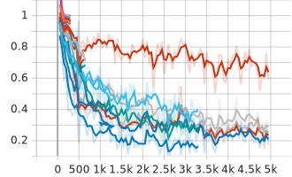
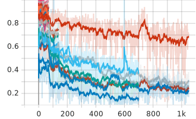

This is after 30 epochs.

### Predicting the density gradient (Before and after training; val dataset)
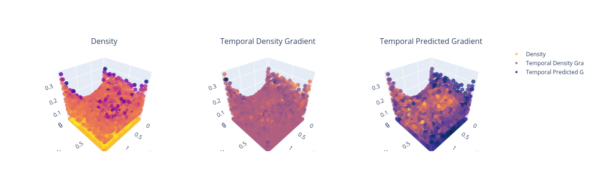
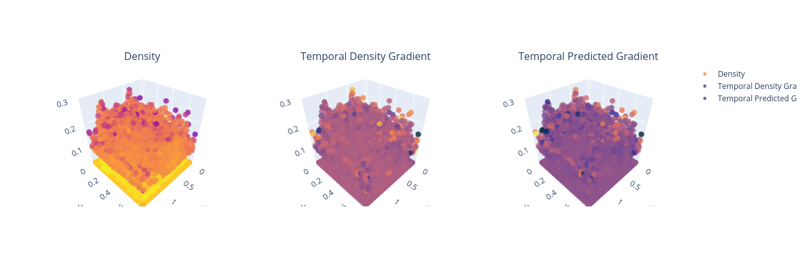

### Predicting the density gradient (Before and after training; train dataset)
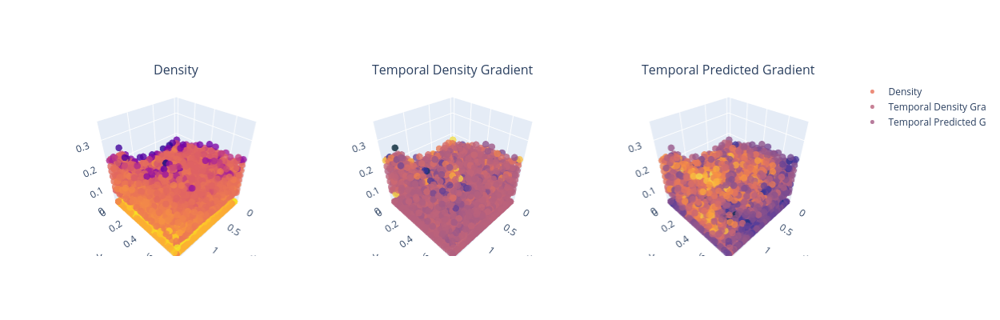
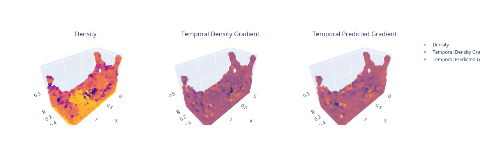

### Each particle and their density gradient prediction. (Before and after training; val and train dataset)
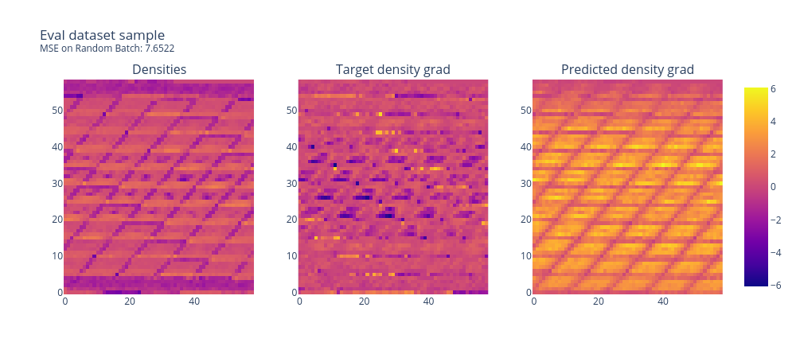
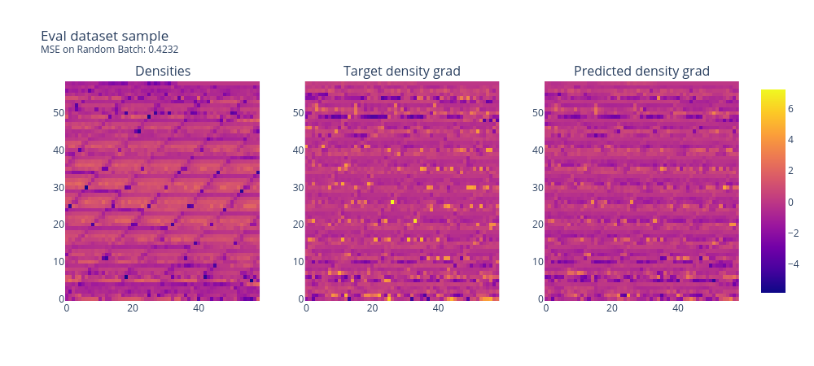
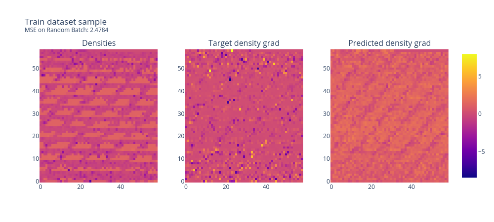
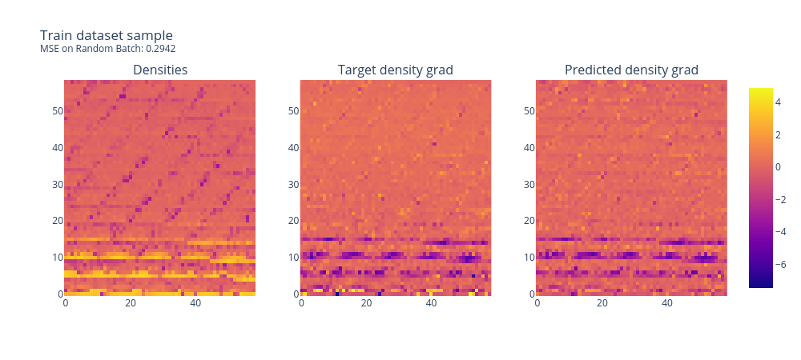

### Loss
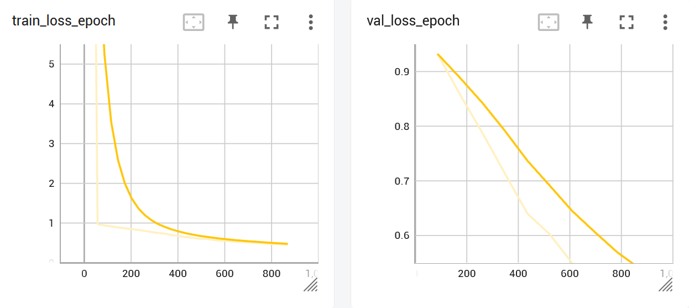

Loss after 30 epochs.